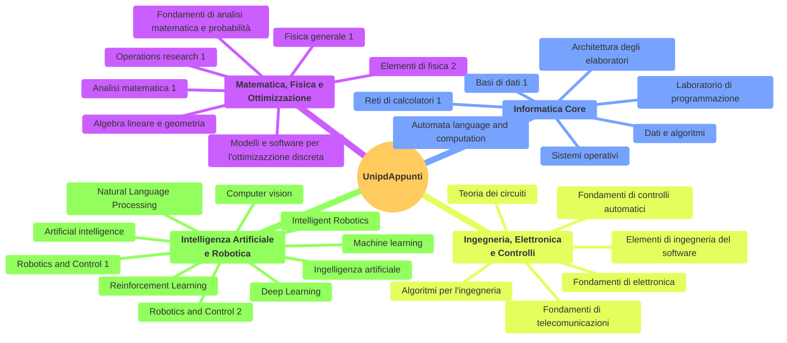

# UnipdAppunti

In questa repository si trovano i pdf con gli appunti di tutti i corsi che
ho seguito. Gli appunti della triennale sono in italiano, quelli della magistrale
sono in inglese. 

Il codice sorgente degli appunti scritti in LaTeX si trova al seguente link -> [luca037/UnipdAppunti-LaTeX](https://github.com/luca037/UnipdAppunti-LaTeX).

---

---

**Primo anno (2021/2022)**

| Materia                        |   Scritti in  |
|--------------------------------|---------------|
| Analisi matematica 1           |   latex       |
| Algebra lineare e geometria    |   latex       |
| Architettura degli elaboratori |   latex       |
| Fisica generale 1              |   goodnotes   |
| Fondamenti di informatica      |   _Missing_   |

---

**Secondo anno  (2022/2023)**

| Materia                                        |   Scritti in|     
|------------------------------------------------|-------------|
| Dati e algoritmi                               |   latex     |
| Elementi di fisica 2                           |   goodnotes |
| Elementi di ingegneria del software            |   latex     |
| Fondamenti di analisi matematica e probabilità |   latex     |  
| Fondamenti di controlli automatici             |   goodnotes |
| Laboratorio di programmazione                  |   latex     |
| Sistemi operativi                              |   latex     |
| Teoria dei circuiti                            |   goodnotes |

---

**Terzo anno (2023/2024)**

| Materia                                          |   Scritti in|
|--------------------------------------------------|-------------|
| Algoritmi per l'ingegneria                       |   latex     |
| Basi di dati 1                                   |   latex     |
| Fondamenti di elettronica                        |   latex     |
| Fondamenti di telecomunicazioni                  |   goodnotes |
| Intelligenza artificiale                         |   latex     |
| Modelli e software per l'ottimizzazione discreta |   latex     |
| Reti di calcolatori 1                            |   latex     |

---

**Quarto anno (2024/2025)**

| Materia                                          |   Scritti in|
|--------------------------------------------------|-------------|
| Artificial intelligence                          |   latex     |
| Automata language and computation                |   latex     |
| Computer vision                                  |   latex     |
| Machine learning                                 |   latex     |
| Neural Networks and Deep Learning                |   latex     |
| Operations research 1                            |   latex     |
| Robotics and Control 1                           |   goodnotes |

---

**Quinto anno (2025/2026)**

| Materia                                          |   Scritti in|
|--------------------------------------------------|-------------|
| Intelligent Robotics                             |   latex     |
| Reinforcement Learning                           |   latex     |
| Robotics and Control 2                           |   goodnotes |
| Natural Language Processing                      |   latex     |

---

